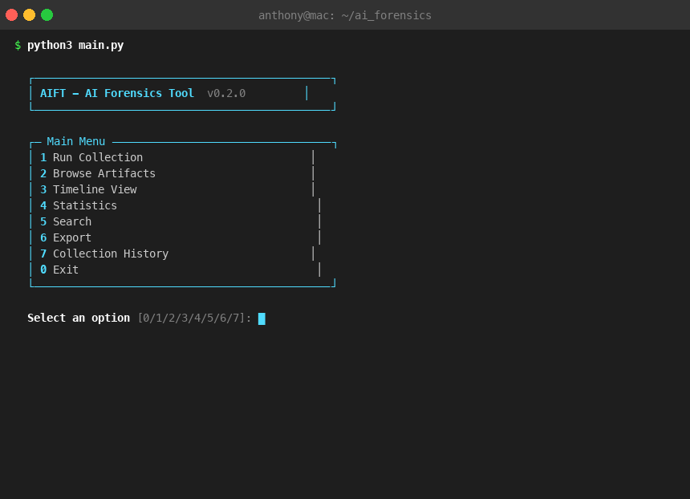

```
     _    ___ _____ _____
    / \  |_ _|  ___|_   _|
   / _ \  | || |_    | |
  / ___ \ | ||  _|   | |
 /_/   \_\___|_|     |_|

 AI Forensics Tool
```

# AI-Forensicator

**Discover, collect, and analyze forensic artifacts from AI tools on macOS.**


---

## What It Does

AIFT scans your macOS system for artifacts left behind by AI-powered tools -- conversation histories, configuration files, session data, browser activity, and more. It collects metadata and content previews into a local SQLite database for analysis, timeline reconstruction, and reporting.

### Feature Highlights

- **40+ AI tool support** -- Claude Code, Claude Desktop, ChatGPT, Cursor, browsers, VS Code extensions, CLI assistants, local LLM runners, and more
- **Read-only collection** -- never modifies source files; SQLite DBs opened in immutable mode
- **Credential redaction** -- API keys, tokens, and secrets are automatically detected and filtered
- **Interactive TUI** -- Rich-powered terminal interface for browsing, searching, and timeline views
- **Export formats** -- CSV, JSON, JSONL, and HTML reports
- **Extensible architecture** -- add new collectors by extending a single base class

---

## Quick Start

```bash
# Clone the repository
git clone https://github.com/ACandeias/AI-Forensicator.git
cd AI-Forensicator

# Install dependencies
pip install -r requirements.txt

# Detect available AI tools
python3 main.py collect --dry-run

# Run full collection
python3 main.py collect

# View statistics
python3 main.py stats

# Launch interactive TUI
python3 main.py
```

Or install as a package:

```bash
pip install .
aift collect --dry-run
```

---

## Demo

<p align="center">
  
</p>

The GIF above shows AIFT's core workflow: interactive TUI menu, dry-run detection of 41 collectors, artifact collection from 10 detected tools, statistics dashboard with source distribution and model usage, artifact browsing, and full-text search with highlighted matches.

---

## Architecture

```
ai_forensics/
|-- main.py                  # CLI entry point + argparse
|-- config.py                # Paths, patterns, constants
|-- schema.py                # AIArtifact + CollectionRun dataclasses
|-- db.py                    # SQLite (WAL mode) database layer
|-- normalizer.py            # Timestamp normalization, sanitization
|-- collectors/
|   |-- __init__.py          # Collector registry (~40 collectors)
|   |-- base.py              # AbstractCollector base class
|   |-- mixins.py            # Shared mixins (Chromium, Electron, VSCode, LLM)
|   |-- claude_code.py       # ~/.claude/ artifacts
|   |-- claude_desktop.py    # Claude Desktop Electron app
|   |-- openai_chatgpt.py    # ChatGPT macOS app
|   |-- openai_atlas.py      # OpenAI Atlas desktop app
|   |-- cursor.py            # Cursor editor
|   |-- browser.py           # Chrome, Safari, Arc AI history
|   |-- brave.py             # Brave browser
|   |-- edge.py              # Microsoft Edge browser
|   |-- generic_logs.py      # System-wide AI log scanning
|   |-- codex.py             # OpenAI Codex CLI
|   |-- copilot.py           # GitHub Copilot
|   |-- perplexity.py        # Perplexity AI
|   |-- lm_studio.py         # LM Studio
|   |-- ollama.py            # Ollama
|   |-- cline.py, roo_code.py, cody.py, ...  # VS Code extensions
|   +-- ... (30+ more)       # See Supported Tools table
|-- analyzers/
|   |-- stats.py             # Summary statistics
|   |-- timeline.py          # Chronological analysis
|   +-- export.py            # CSV/JSON/JSONL/HTML export
|-- ui/
|   +-- terminal.py          # Rich-based interactive TUI
+-- tests/
    |-- test_collectors.py   # Base collector unit tests
    |-- test_db.py           # Database operation tests
    +-- test_schema.py       # Data model tests
```

---

## Supported Tools

### Core AI Tools

| Tool | Status | Data Collected |
|------|--------|----------------|
| Claude Code | Full | Prompt history, session conversations, settings, plans, tasks, debug logs |
| Claude Desktop | Full | MCP config, app config, session/local storage, IndexedDB, preferences, SQLite DBs |
| ChatGPT (macOS) | Full | Encrypted conversation metadata, preferences |
| OpenAI Atlas | Full | Encrypted conversations, plist tabs, Chromium history, profile, analytics |
| Cursor | Full | Composer sessions, bubble messages, usage stats, auth flags |
| Generic Logs | Full | AI keyword matches in ~/Library logs, installed AI apps |

### Browsers

| Tool | Status | Data Collected |
|------|--------|----------------|
| Chrome | Full | AI-related browsing history |
| Safari | Full | AI-related browsing history (requires Full Disk Access) |
| Arc | Full | AI-related browsing history |
| Brave | Full | AI-related browsing history |
| Microsoft Edge | Full | AI-related browsing history |

### VS Code Extensions

| Tool | Status | Data Collected |
|------|--------|----------------|
| Cline | Full | Task conversations, API history, UI messages |
| Roo Code | Full | Task conversations, custom modes, MCP settings |
| Supermaven | Full | Extension storage data |
| Sourcegraph Cody | Full | Extension data, standalone app data |
| Tabnine | Full | VDB logs, preferences |

### CLI Coding Assistants

| Tool | Status | Data Collected |
|------|--------|----------------|
| OpenAI Codex | Full | JSONL history, session conversations, config |
| GitHub Copilot | Full | Config, usage data |
| Copilot CLI | Full | Command history, session state, MCP config |
| Windsurf/Codeium | Full | State DB, Cascade conversations, Electron storage |
| Continue.dev | Full | Config, sessions, dev data |
| Aider | Full | Chat history transcripts, config |
| Amazon Q Developer | Full | Chat history, CLI config, todo lists |

### Local LLM Runners

| Tool | Status | Data Collected |
|------|--------|----------------|
| LM Studio | Full | Settings, MCP config, model inventory, server logs |
| Ollama | Full | Model manifests (names, digests, sizes), config |
| Jan AI | Full | Conversation threads, model configs, app log |
| GPT4All | Full | Chat history, LocalDocs metadata, model inventory |
| Msty | Full | Chat history, model configs |

### Productivity, Chat, & Creative

| Tool | Status | Data Collected |
|------|--------|----------------|
| Perplexity | Full | Electron LevelDB/IndexedDB data |
| Raycast AI | Full | Extension inventory, preferences |
| Notion AI | Full | SQLite cache, Electron storage |
| Poe | Full | Electron LevelDB/IndexedDB data |
| Microsoft Copilot | Full | JSON/plist config (sandboxed) |
| DiffusionBee | Full | Image inventory metadata, models, generation configs |
| ComfyUI Desktop | Full | Workflow JSON, model config YAML |
| Draw Things | Full | Model inventory metadata (sandboxed) |
| Grammarly | Full | Launch agent detection, cache info, preferences |
| Pieces | Full | Snippet inventory, context metadata, logs |
| JetBrains AI | Full | AI assistant data across all JetBrains IDEs |
| Warp Terminal | Full | Launch configs, AI command history, settings |
| cagent | Full | OCI container manifests with annotations |

---

## CLI Reference

```bash
# Detection only (no collection)
python3 main.py collect --dry-run

# Full collection
python3 main.py collect
python3 main.py collect -v          # verbose logging

# Browse artifacts
python3 main.py browse
python3 main.py browse --source "Claude Code" --type conversation_message --limit 20

# Summary statistics
python3 main.py stats

# Search
python3 main.py search "query string"

# Timeline
python3 main.py timeline
python3 main.py timeline --start 2024-01-01 --end 2024-12-31 --source "Claude Code"

# Export
python3 main.py export csv output.csv
python3 main.py export json output.json
python3 main.py export jsonl output.jsonl
python3 main.py export report report.html

# Interactive TUI
python3 main.py
```

---

## Security Model

AIFT is designed for **read-only forensic collection** with built-in privacy protections:

- All SQLite databases are opened with `?immutable=1` -- no writes to source files
- Credential patterns (API keys, tokens, passwords, AWS keys, Stripe keys, Slack tokens) are automatically redacted
- OAuth token caches and MCP server environment variables are filtered
- Credential files (.env, credentials.json, etc.) are flagged but never read
- Symlinks are skipped to prevent path traversal
- File size limit of 50 MB prevents memory exhaustion

See [SECURITY.md](SECURITY.md) for full details.

---

## Contributing

We welcome contributions! See [CONTRIBUTING.md](CONTRIBUTING.md) for:

- How to add a new collector
- Code style guidelines
- Testing requirements

---

## License

MIT License -- see [LICENSE](LICENSE) for details.
